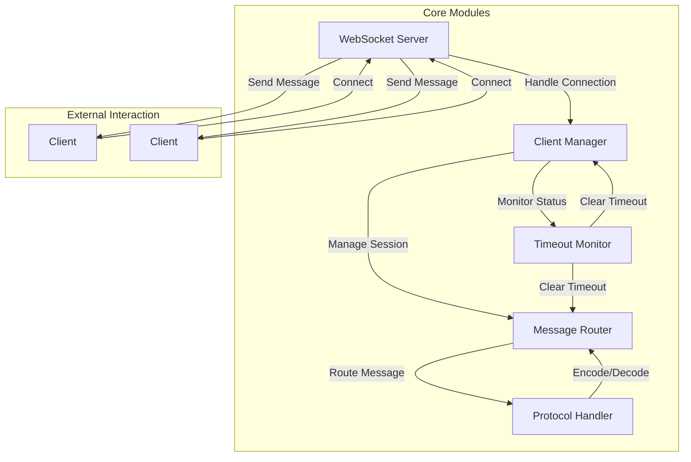

# PeerJS-Server Signaling Workflow & Protocol


## HTTP API

Endpoints:

- GET `/` - return a JSON to test the server.

  - Response: `application/json`

  ```json
  {
      "name": "PeerJS Server",
      "description": "A server side element to broker connections between PeerJS clients.",
      "website": "https://peerjs.com/"
  }
  ```

This group of methods uses `key` option from config:

- GET `/<key>/id` - return a new user id. required `key` from config.

  - `key`: string

  - Response: `text/plain` uuid generate with '-' format

- GET `/<key>/peers` - return an array of all connected users. required `key` from config. **IMPORTANT:** You should set `allow_discovery` to `true` in config to enable this method. It disabled by default.

  - `key`: string

  - Response: `application/json` an array of all connected users


## WebSocket API

### Endpoints

`/peerjs?key=<key>&id=<id>&token=<token>`

### Protocol

```typescript

enum MessageType {
    OPEN = "OPEN", // server-side
    LEAVE = "LEAVE",    // transmission
    CANDIDATE = "CANDIDATE",    // transmission
    OFFER = "OFFER",    // transmission
    ANSWER = "ANSWER",    // transmission
    EXPIRE = "EXPIRE",    // transmission & server-side
    HEARTBEAT = "HEARTBEAT",    // client-side
    ID_TAKEN = "ID-TAKEN", // server-side
    ERROR = "ERROR", // server-side
}
 

interface IMessage {
    type: MessageType;
    src?: string;
    dst?: string;
    payload?: any;
}

```

data examples

```json

{
    "type":"HEARTBEAT"
}

{
    "type": "OFFER",
    "payload": {
        "sdp": {
            "type": "offer",
            "sdp": "..."
        },
        "type": "data",
        "connectionId": "dc_mgqsb2hzkbe",
        "label": "dc_mgqsb2hzkbe",
        "reliable": false,
        "serialization": "binary"
    },
    "dst": "6481452f-2c1d-4bf3-91b3-58d3c92080f0"
}

{
    "type": "CANDIDATE",
    "payload": {
        "candidate": {
            "candidate": "...",
            "sdpMLineIndex": 0,
            "sdpMid": "0",
            "usernameFragment": "..."
        },
        "type": "data",
        "connectionId": "dc_mgqsb2hzkbe"
    },
    "dst": "6481452f-2c1d-4bf3-91b3-58d3c92080f0"
}
```


## Workflow

1. Connecting
   1.  clients use Websocket at `/peerjs?key=<key>&id=<id>&token=<token>` to connect to server; `id` is an unique identifier for this client. `id` and `token` are generated outside.
   2.  when a client connect to this server, the server will check if this client `id` exist. 
       - If this client `id`  exists and the token is invalid, a `ID-TAKEN` message will be send and the connection will be closed. 
       - If this client `id` exists and the token is valid, this client will replace of the old one
       - If this client `id`  doesn't exist, the server should record this client for session.
   3.  after the client is successfully connected, the server will send a `OPEN` message to this client.
2. Transmission
   1. when server receives a message from a client, it will check the `"src"` field. then 
   2. when the message is one of `CANDIDATE` , `OFFER`, `ANSWER`, `EXPIRE`, this will be transmit to the destination client with the client `id` specific in  `"dst"`  field. If the destination client doesn't exist, the message should be store with a **expire time**.
   3. when a client connected (after `OPEN` message sent by server), these stored messages should be check and transmit first.
   4. if a stored message is expired, it should be remove from the storage and a `EXPIRE` message should be send back to the source client.

3. Timeout
   1. for a client `id`, if it is too long (over **timeout**) to receive a message (Transmission message or `HEARTBEAT`) , the record should be clear and the connection should be closed.

4. Close
   1. when a client close the Websocket connection, the record of this client `id` should be clear.


